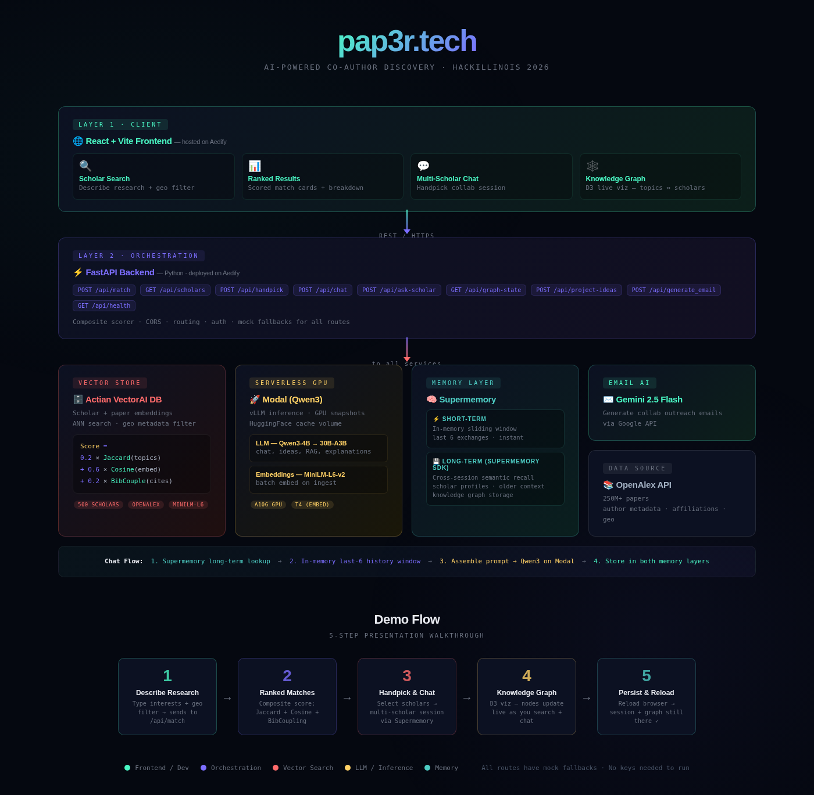

# pap3r.tech

AI-powered co-author discovery platform. Describe your research, get ranked collaborator matches, handpick scholars, and explore ideas through multi-scholar chat.

Built for HackIllinois 2026.

Hosted at: https://papertech-a30fb500.aedify.ai/
.tech domain: http://pap3r.tech/

## Architecture



## How It Works

1. **Describe Research** — Type your research interests + optional geo filter, sends to `/api/match`
2. **Ranked Matches** — Composite scored results: Jaccard + Cosine + BibCoupling breakdown per scholar
3. **Handpick & Chat** — Select scholars, start a multi-scholar session, chat about collaboration via Supermemory
4. **Knowledge Graph** — D3 visualization updates live as you search and chat
5. **Persist & Reload** — Session + graph survive browser reload via long-term memory

## Quick Start

```bash
git clone <repo-url> && cd paper.tech
chmod +x dev.sh
./dev.sh
```

This installs all dependencies and starts both servers:
- **Frontend**: http://localhost:5173
- **Backend API**: http://localhost:8000
- **Swagger UI**: http://localhost:8000/docs

## Prerequisites

- **Node.js 18+** — [nodejs.org](https://nodejs.org)
- **Python 3.11+** — [python.org](https://python.org)
- **uv** — `curl -LsSf https://astral.sh/uv/install.sh | sh`
- **Docker** — for Actian VectorAI DB (optional, 200 mock scholars work without it)

## Composite Scoring Engine

Scholar matching uses a weighted composite score:

```
Score = 0.2 * Jaccard(topics) + 0.6 * Cosine(embeddings) + 0.2 * BibCoupling(citations)
```

- **Jaccard**: Topic keyword overlap between your query and the scholar's research areas
- **Cosine**: Semantic similarity via ANN search on `all-MiniLM-L6-v2` embeddings in Actian VectorAI DB
- **BibCoupling**: Co-citation graph edge weight from shared reference networks

## Hybrid Memory Architecture

The chat system uses a two-layer memory approach:

| Layer | Storage | Purpose | Latency |
|---|---|---|---|
| **Short-term** | In-memory dict per session | Recent conversation turns (last 6 exchanges) | Instant |
| **Long-term** | Supermemory (semantic search) | Cross-session recall, scholar profiles, older context | ~1-2s |

**Chat flow:** Supermemory long-term lookup → In-memory last-6 history window → Assemble prompt → Qwen3 on Modal → Store in both memory layers

## Smart Chat

The multi-scholar chat understands context about your handpicked scholars and can:

- **Explain specialties** — "What do these scholars specialize in?"
- **Recommend scholars** — "Who would be a good choice for NLP research?"
- **Compare profiles** — "Compare their h-index and expertise"
- **Suggest projects** — "What collaboration ideas do you see?"
- **Draft emails** — "Write an outreach email to Dr. Osei"
- **Scholar deep-dive** — Ask about any scholar by name for a detailed profile

## API Routes

| Method | Endpoint | Description |
|---|---|---|
| POST | `/api/match` | Ranked co-author search (Actian VectorAI + composite scoring) |
| GET | `/api/scholars` | List all 200 scholars (Actian VectorAI or mock) |
| POST | `/api/handpick` | Create multi-scholar session (stores in Supermemory) |
| POST | `/api/chat` | Chat in a session (hybrid memory + Modal LLM) |
| POST | `/api/ask-scholar` | Per-scholar RAG Q&A (Modal LLM) |
| GET | `/api/graph-state` | Knowledge graph data for D3 visualization |
| POST | `/api/project-ideas` | Generate collaboration ideas (Modal LLM) |
| POST | `/api/generate_email` | Generate collaboration email (Gemini 2.5 Flash) |
| GET | `/api/health` | Health check |

## Manual Setup

### Backend

```bash
cd backend
uv sync
uv run uvicorn app.main:app --reload --port 8000
```

### Frontend

```bash
cd frontend
npm install
npm run dev
```

### Actian VectorAI DB (optional)

Start the vector database with Docker:

```bash
docker compose up -d vectoraidb
```

Then initialize schema and ingest data from OpenAlex:

```bash
cd backend/db-scripts
python schema.py              # create collections
python ingest.py              # fetch 500 scholars from OpenAlex, embed, store
```

When the DB is running, `/api/match` and `/api/scholars` automatically use real vector search. When unavailable, they fall back to 200 mock scholars across 15+ CS research fields.

## Environment Variables

All config lives in a single `.env` at the project root.

| Variable | Description | Required |
|---|---|---|
| `SUPERMEMORY_KEY` | Supermemory API key (long-term memory layer) | For chat memory |
| `ACTIAN_DB_URL` | Actian VectorAI DB address (default: `127.0.0.1:50051`) | For real vector search |
| `MODAL_LLM_ENDPOINT` | Modal Qwen3-4B inference URL | For LLM chat/ideas |
| `MODAL_EMBED_ENDPOINT` | Modal embedding function URL | For embeddings |
| `GOOGLE_API_KEY` | Google API key for Gemini 2.5 Flash | For email generation |
| `GITHUB_TOKEN` | GitHub PAT for GPT-4o-mini via GitHub Models | Benchmark only |
| `GROQ_API_KEY` | Groq API key for Llama 3.3 70B judge | Benchmark only |
| `OPENALEX_EMAIL` | Email for OpenAlex API (polite pool) | For data ingestion |
| `FRONTEND_URL` | Allowed CORS origin (default: `http://localhost:5173`) | Production |
| `ENVIRONMENT` | Deployment environment (default: `development`) | Production |

All routes have mock fallbacks — the app runs fully without any keys set.

## Modal Deployment

Deploy the Qwen3-4B LLM and MiniLM embeddings to Modal:

```bash
cd backend
uv run modal setup              # one-time auth
uv run modal deploy modal_app.py
```

Add the printed endpoint URLs to your `.env`:
```
MODAL_LLM_ENDPOINT=https://<username>--paper-tech-llmserver-v1-chat-completions.modal.run
MODAL_EMBED_ENDPOINT=https://<username>--paper-tech-embedserver-embed.modal.run
```

Features: A10G GPU, vLLM serving, GPU memory snapshots for fast cold starts, persistent HuggingFace cache volume.

## Benchmark

Compare multi-turn context retention across 5 setups:

| Setup | Description |
|---|---|
| GPT-4o-mini | Full history, via GitHub Models |
| Gemini 2.5 Flash | Full history, via Google GenAI |
| Qwen3-4B (no memory) | Each turn independent, no context |
| Qwen3-4B (full history) | Full conversation history in prompt |
| Qwen3-4B + Supermemory | Hybrid: sliding window + Supermemory retrieval |

```bash
cd backend
uv run python -m benchmark.benchmark
uv run python -m benchmark.plots
```

Results and plots saved to `backend/benchmark/results/`.

## Aedify Deployment

The app is deployed as a unified container on [Aedify](https://aedify.ai). The FastAPI backend serves both the API and the pre-built frontend static files.

1. Connect the GitHub repo in the Aedify dashboard
2. Select the backend Docker component
3. Add all environment variables from `.env`
4. Deploy — Aedify builds from the Dockerfile and serves on a live URL

## Sponsor Integrations

| Sponsor | Integration | Files |
|---|---|---|
| **Supermemory** | Long-term semantic memory, session context, document storage | `app/supermemory.py`, `routers/chat.py`, `routers/handpick.py` |
| **Actian VectorAI DB** | Scholar/paper embeddings, ANN search, geo-filtered queries, composite scoring | `app/vectordb.py`, `routers/match.py`, `routers/scholars.py`, `db-scripts/` |
| **Modal** | Serverless GPU for Qwen3-4B LLM + MiniLM embeddings (A10G + T4) | `modal_app.py`, `app/supermemory.py` |
| **Aedify** | Full-stack deployment, GitHub auto-deploy, environment variable management | `backend/Dockerfile` |

## Project Structure

```
paper.tech/
├── frontend/                 # React + Vite SPA
│   ├── src/
│   │   ├── api/client.js     # Axios API client
│   │   ├── components/       # ScholarCard, ChatPanel, GeoFilter, etc.
│   │   └── pages/            # LandingPage, ResultsPage, EmailDraftPage
│   └── vite.config.js        # /api proxy to backend
├── backend/
│   ├── app/
│   │   ├── main.py           # FastAPI app, CORS, static file serving
│   │   ├── config.py         # Pydantic BaseSettings
│   │   ├── vectordb.py       # Actian VectorAI DB client + composite scoring
│   │   ├── supermemory.py    # Hybrid memory (short-term + Supermemory)
│   │   ├── mock_data.py      # 200 scholars across 15+ CS fields
│   │   ├── models/schemas.py # Pydantic request/response models
│   │   ├── routers/          # match, scholars, handpick, chat, graph, ideas
│   │   └── routes/email.py   # Email generation (Gemini 2.5 Flash)
│   ├── db-scripts/           # Actian schema, OpenAlex ingest, scoring
│   ├── benchmark/            # Multi-turn context retention benchmark
│   ├── modal_app.py          # Modal deployment config
│   ├── static/               # Pre-built frontend (served by FastAPI)
│   └── Dockerfile            # Aedify deployment
├── docs/
│   └── architecture.png      # System architecture diagram
├── docker-compose.yml        # Actian VectorAI DB container
├── dev.sh                    # One-command startup
└── .env                      # Environment variables (gitignored)
```

## Branch Workflow

1. Create a feature branch: `git checkout -b feature/your-feature`
2. Make changes, commit, push: `git push -u origin feature/your-feature`
3. Open a PR to `main`

## Adding Dependencies

- **Backend**: `uv add <package>` (from project root)
- **Frontend**: `cd frontend && npm install <package>`
